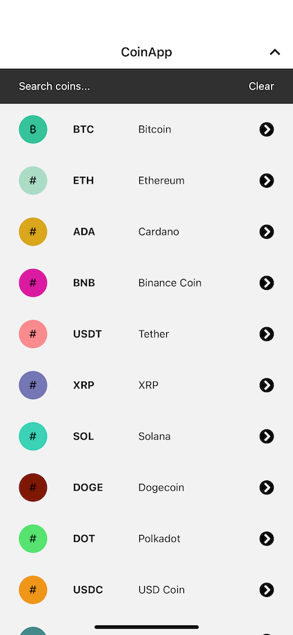
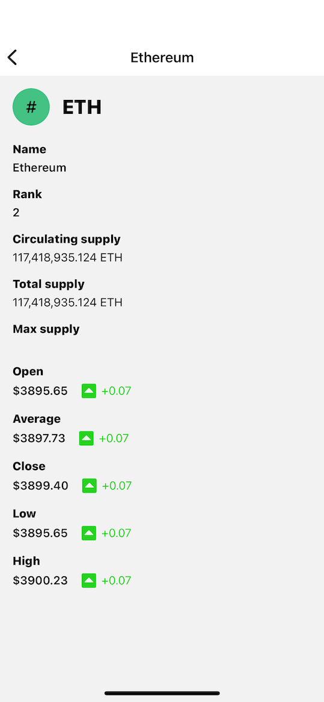

# Coin App

## Run & Setup

1. Clone repo
2. Run `yarn` command in root folder
3. Run `yarn start`

### For android:

4. run `yarn android`

### For ios:

4. navigate to `ios` folder and run `pod install`
5. run `yarn ios`

